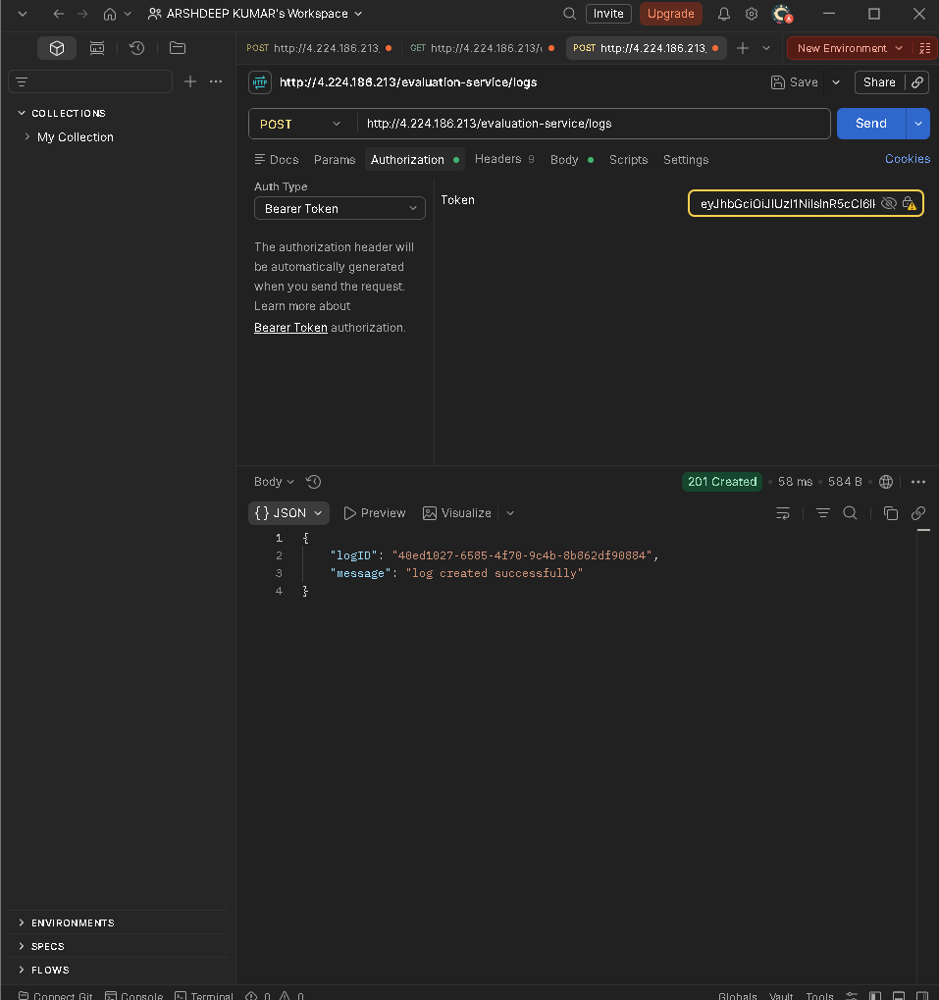
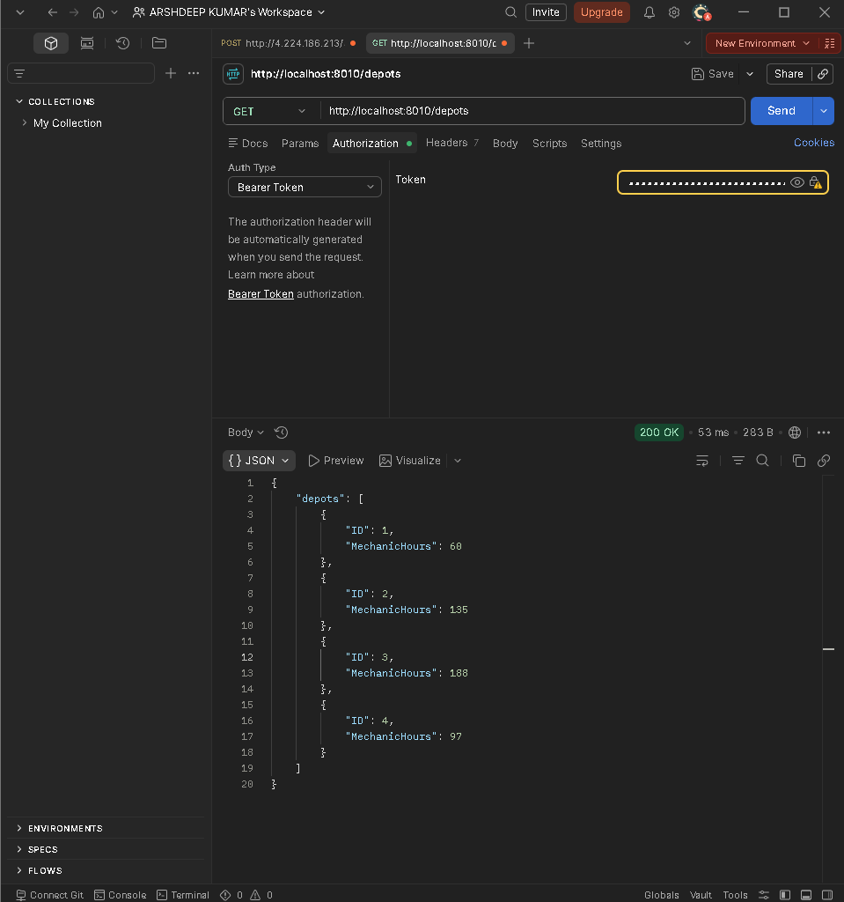
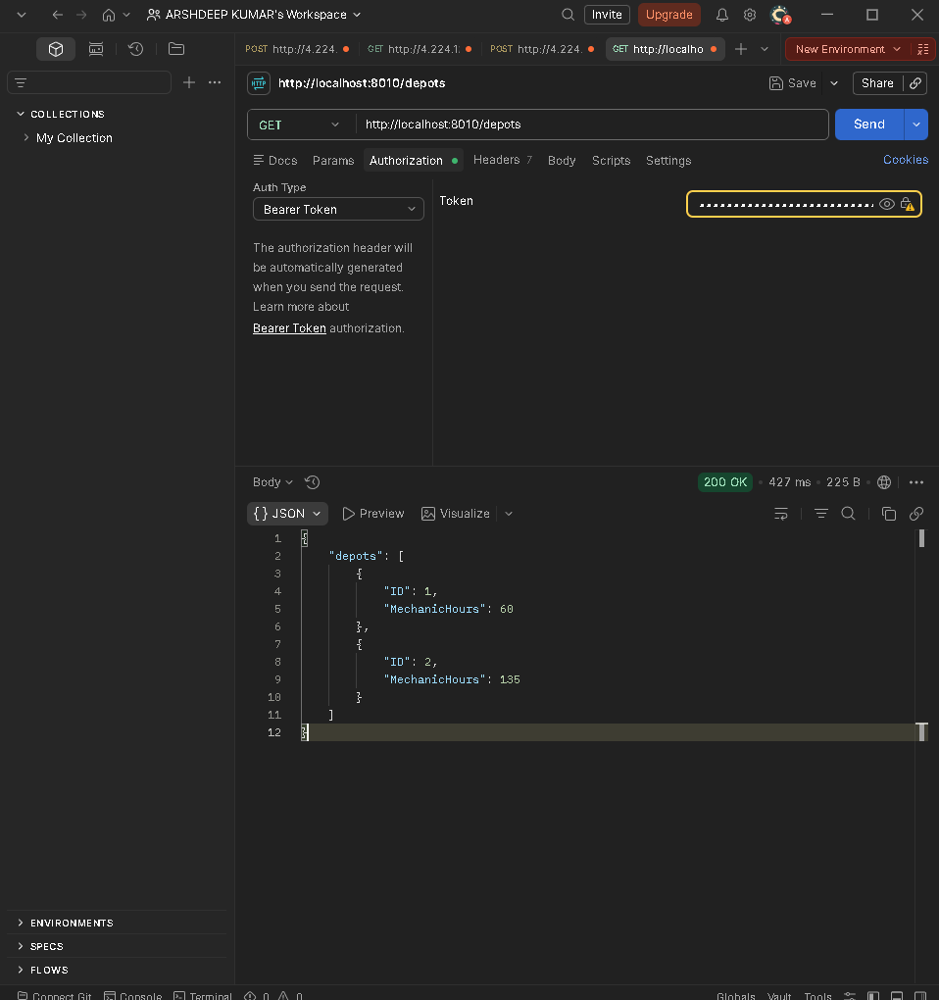
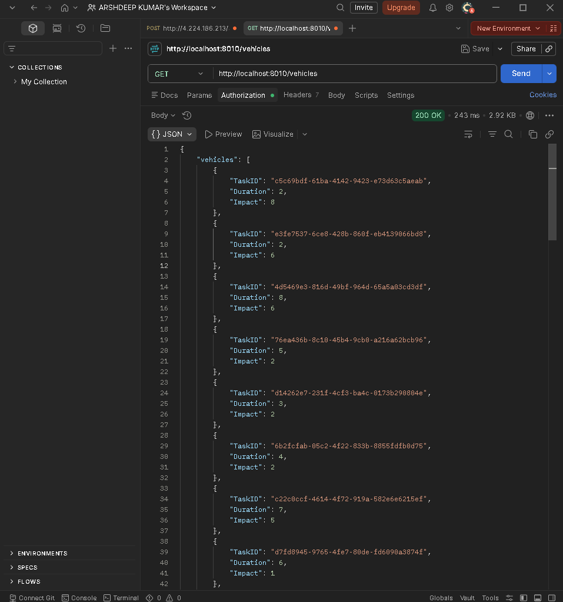
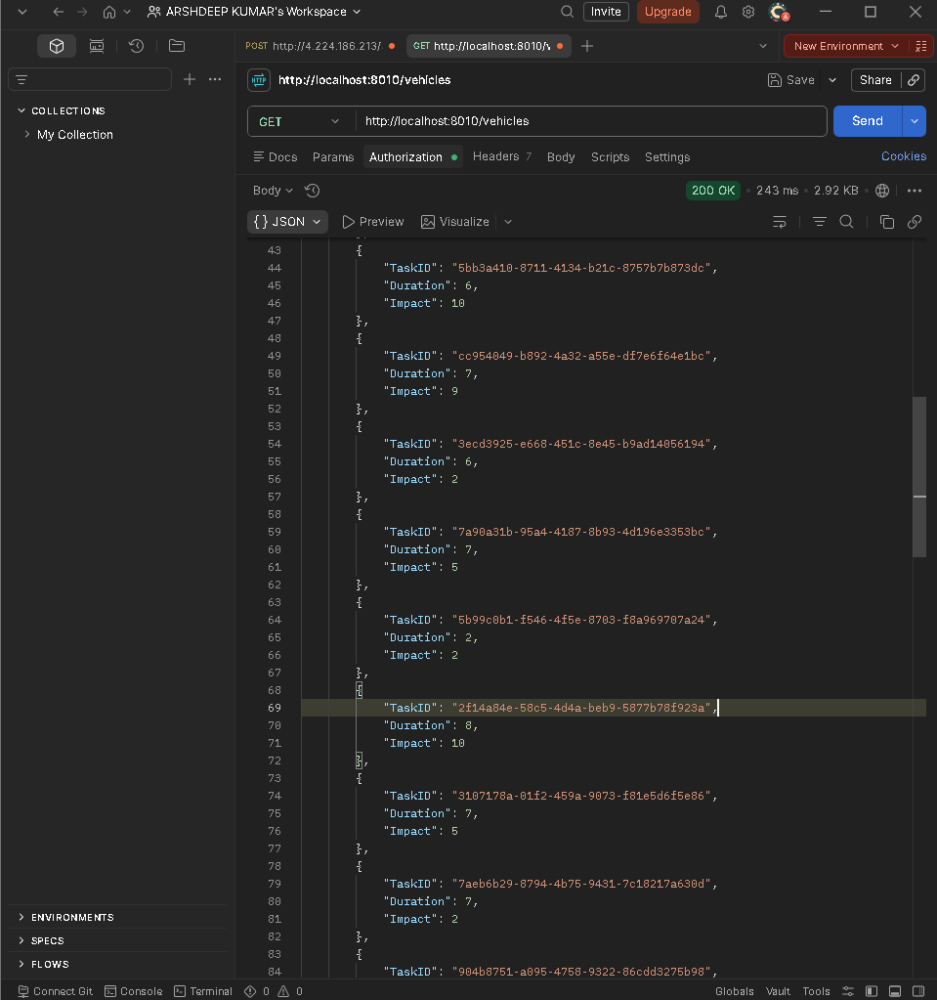
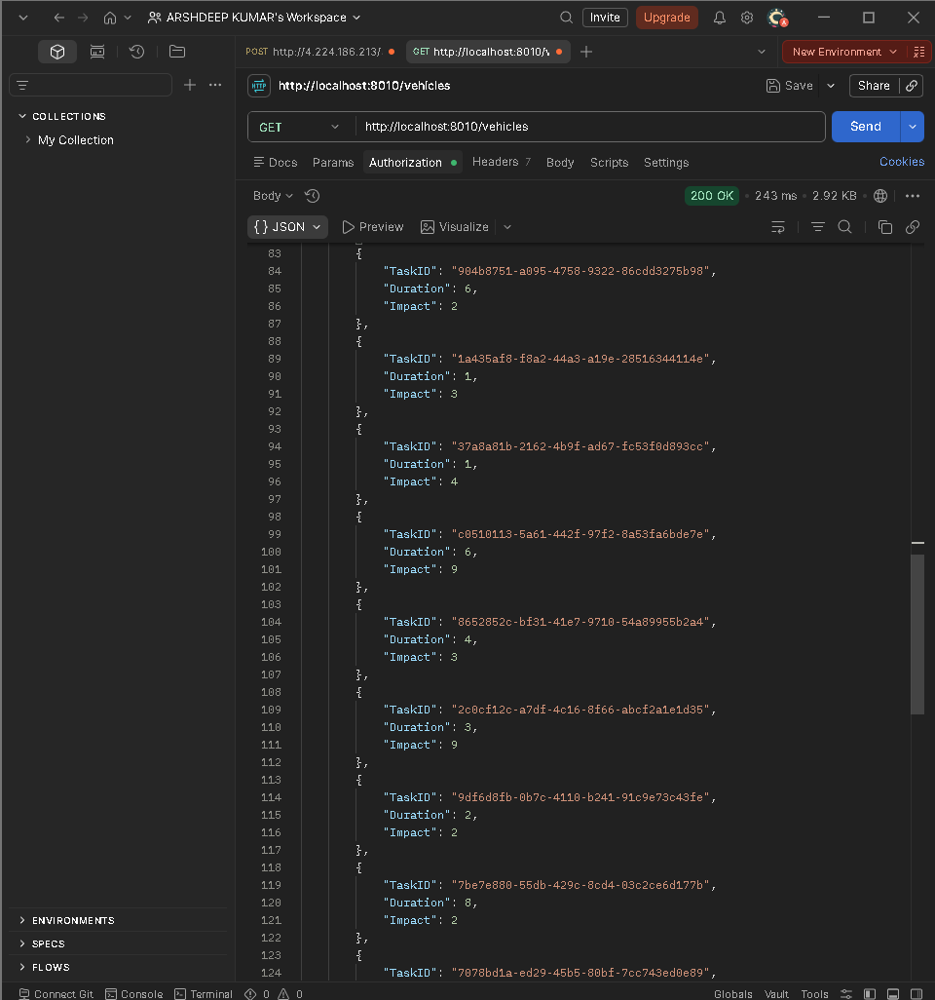
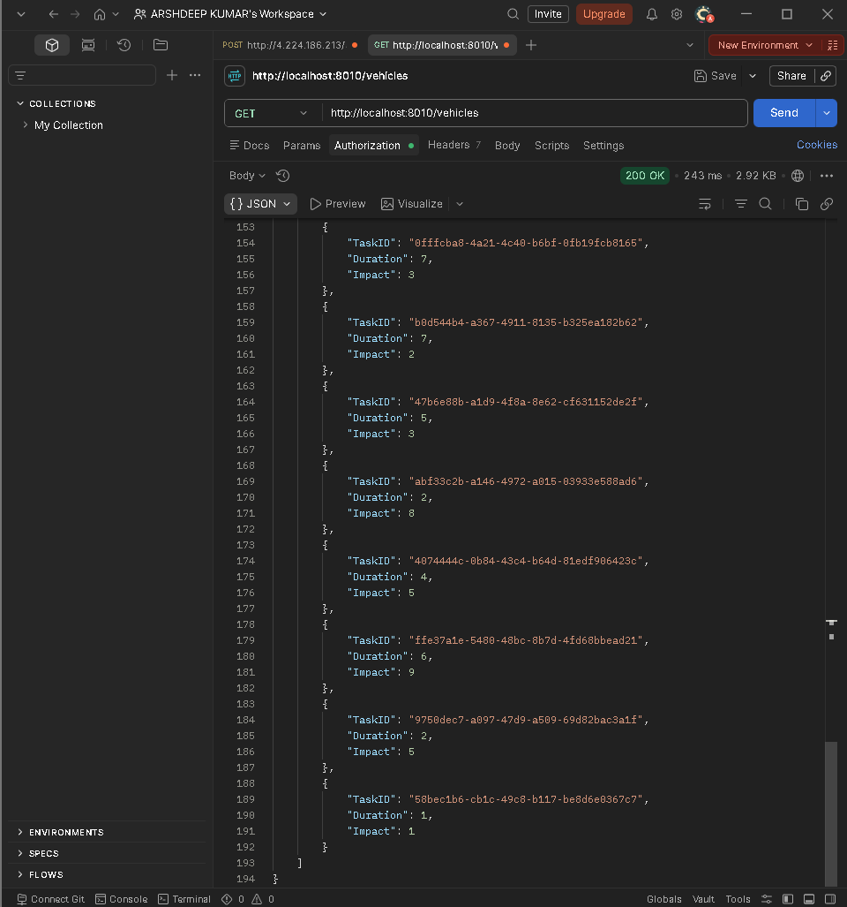

# AffordMed Backend Assessment

## Candidate Information

* **Name:** Arshdeep Kumar
* **Roll Number:** 2301921630013
* **Profile:** Backend Developer

---

# Repository Structure

```text
2301921630013
│
├── logging-middleware
├── vehicle-scheduling_be
├── notification-system-design
├── notification-service
├── screenshots
└── README.md
```

---

# 1. Logging Middleware

Implemented a centralized logging middleware according to the assessment requirements.

## Features

* Protected Log API integration
* Bearer Token Authentication
* Standardized log structure
* Backend package validation
* Centralized logging support

## Log API Working Screenshot



---

# 2. Vehicle Maintenance Scheduler Microservice

Developed a Spring Boot microservice that schedules vehicle maintenance tasks while maximizing operational impact under limited mechanic-hours constraints.

## Features

* Spring Boot REST APIs
* Bearer Token Authentication
* External API Integration
* Dynamic Depot Retrieval
* Dynamic Vehicle Retrieval
* Knapsack Algorithm Implementation
* Schedule Generation based on maximum impact

## Technologies Used

* Java 17
* Spring Boot
* Maven
* RestTemplate
* Postman

---

## Depots API Response





---

## Vehicles API Response









---

## Implemented Endpoints

### Get Depots

```http
GET /depots
```

### Get Vehicles

```http
GET /vehicles
```

### Generate Schedule

```http
GET /schedules/{depotId}
```

---

# 3. Campus Notification System Design

Implemented all required stages for the Campus Notification System Design.

## Stage 1

* REST API Design
* JSON Contracts
* WebSocket Design
* Notification Schema

## Stage 2

* Database Design
* PostgreSQL Schema
* Indexing Strategy
* Scaling Considerations

## Stage 3

* Query Optimization
* Composite Indexes
* Performance Improvements
* SQL Queries

## Stage 4

* Caching Strategies
* Pagination
* Database Load Reduction
* System Scalability

## Stage 5

* High Scale Notification Delivery
* Queue Based Architecture
* Reliable Email Processing
* Fault Tolerance

## Stage 6

* Priority Notification Service
* Top 10 Notification Retrieval
* Heap Based Optimization

---

# 4. Notification Service

Implemented a Spring Boot service that returns the highest-priority unread notifications.

## Features

* Notification Model
* Priority Calculation
* Sorting by Recency
* Top 10 Notifications Retrieval
* REST Endpoint

## Priority Order

```text
PLACEMENT > RESULT > EVENT
```

## Endpoint

```http
POST /notifications/top
```

---

# Technologies Used

* Java 17
* Spring Boot
* Maven
* REST APIs
* PostgreSQL (Design)
* Git
* GitHub
* Postman

---

# Project Status

Logging Middleware Completed

 Vehicle Maintenance Scheduler Completed

 Campus Notification System Design Completed

 Notification Service Completed

---

# Submission

This repository contains the complete solution for the AffordMed Backend Assessment for the Backend Developer profile.
